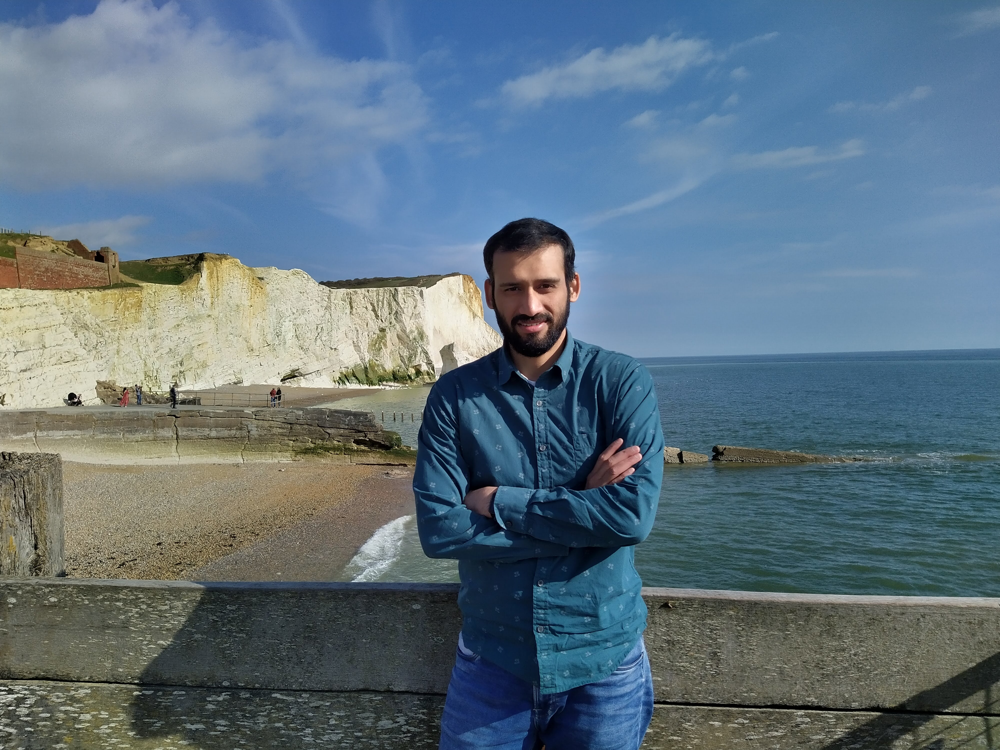

Hi, I’m Dipanjan Mandal, a post-doctoral fellow at Department of Physical and Chemical Sciences, [University of L'Aquila](https://www.dsfc.univaq.it/en/department), L'Aquila, Italy. I joined here in November 2024. Currently I am working on dynamical and equilibrium properties of different chemical systems using machine learend inter-atomic potentials with the supervision of [Prof. Carlo Pierleoni](https://www.aquila.infn.it/cpierleo/). Prior to this I was a post-doctoral research associate from 2019-2024 at Department of Physics, [University of Warwick](https://warwick.ac.uk/fac/sci/physics/), Coventry, UK. My research area is broadly in Statistical Physics. At Warwick, I worked with [Prof. David Quigley](https://warwick.ac.uk/fac/sci/physics/staff/research/dquigley/), where I studied the nucleation properties of simple lattice-gas models in the presence of static or dynamic impurities. We also explored different roles played by impurities at the time of droplet formation. These could be surfactant, bulk-stabilizer, nucleant or inert-spectator. During my PhD, at [The Institute of Mathematical Sciences](https://www.imsc.res.in/), India, I studied the entropy driven phase transitions and critical properties of the system hard particles with different geometrical shapes on lattice, under the supervision of [Prof. R. Rajesh](https://sites.google.com/view/rrajeshshomepage/home). Immediately after my PhD, I was a post-doctoral fellow at [Tata Institute of Fundamental Research](https://www.tifrh.res.in/), Hyderabad in 2019, working with [Prof. Kabir Ramola](https://www.tifrh.res.in/~kramola/) on active random walk.

## Education & Research Experience
Post Doctoral Fellow, Department of Physical and Chemical Sciences, University of L'Aquila, L'Aquila, Italy (2024-current)

Post Doctoral Research Associate, Department of Physics, University of Warwick, Coventry, United Kingdom (2019-2024). 

Post Doctoral Fellow, Tata Institite of Fundamental Research, Hyderabad, India (April-October, 2019).

Ph.D. in Theoretical Physics, The Institiute of Mathematical Sciences, Chennai, India (2014-2019), Ph.D. thesis title "Entropy driven phase transitions in hard core lattice gases".

M. Sc. in theoretical Physics, The Institiute of Mathematical Sciences, Chennai, India (2012-2014).

B. Sc. in Physics Honours, Ramakrishnamission Vidyamandira, Howrah, India, affiliated to the University of Calcutta (2009-2012).

## Research Area
Statistical Mechanics: Monte Carlo simulations, Hard core lattice-gas models, Nucleation in simple models, Jamming and Percolation transitions, Active random walk.

[Research interest](https://github.com/dipanjan308/dipanjan308.github.io/files/13333776/research_interest_dipanjan.pdf)

## Publication
1. *Low temperature nucleation rate calculations using the N-Fold way*, Federico Ettori, Dipanjan Mandal, David Quigley, [J. Chem. Phys. 162, 124116 (2025)](https://doi.org/10.1063/5.0255066).
1. *Mapping the influence of impurity interaction energy on nucleation in a lattice-gas model of solute precipitation*, Dipanjan Mandal, David Quigley, [ Soft Matt. 20, 7174-7184, (2024)](https://pubs.rsc.org/en/content/articlelanding/2024/sm/d4sm00815d).
1. *Phases of the hard-plate lattice gas on a three-dimensional cubic lattice*, Dipanjan Mandal, Geet Rakala, Kedar Damle, Deepak Dhar, R. Rajesh, [Phys. Rev. E 107, 064136 (2023)](https://doi.org/10.1103/PhysRevE.107.064136).
1. *Spontaneous layering and power-law order in the three-dimensional fully-packed hard-plate lattice gas*, Geet Rakala, Dipanjan Mandal, S. Biswas, Kedar Damle, Deepak Dhar, R. Rajesh, [Phys. Rev. E 107, 064137 (2023)](https://doi.org/10.1103/PhysRevE.107.064137).
1. *Kinetic control of competing nuclei in a dimer lattice-gas model*, Dipanjan Mandal, David Quigley, [J. Chem. Phys. 157, 214501 (2022)](https://doi.org/10.1063/5.0120483).
1. *The freezing phase transition in hard core lattice gases on triangular lattice with exclusion up to seventh next-nearest neighbor*, A. A. A. Jaleel, Dipanjan Mandal, J. E. Thomas, R. Rajesh, [Phys. Rev. E 106 (4), 044136 (2022) (Editor's suggestion)](https://doi.org/10.1103/PhysRevE.106.044136).
1. *Active random walks in one and two dimensions*, Stephy Jose, Dipanjan Mandal, Mustansir Barma, Kabir Ramola, [Phys. Rev. E 105 (6), 064103 (2022)](https://doi.org/10.1103/PhysRevE.105.064103).
1. *Rejection-free cluster Wang-Landau algorithm for hard-core lattice gases*, A. A. A. Jaleel, J. E. Thomas, Dipanjan Mandal, Sumedha, R. Rajesh, [Phys. Rev. E 104 (4), 045310 (2021)](https://doi.org/10.1103/PhysRevE.104.045310).
1. *Hard core lattice gas with third next-nearest neighbor exclusion on triangular lattice: One or two phase transitions?*, A. A. A. Jaleel, Dipanjan Mandal, R. Rajesh, [J. Chem. Phys. 155 (22), 224101 (2021)](https://doi.org/10.1063/5.0066098).
1. *Nucleation rate in the two dimensional Ising model in the presence of random impurities*, Dipanjan Mandal, David Quigley, [Soft Matt. 17 (38), 8642-8650 (2021)](https://pubs.rsc.org/en/content/articlelanding/2021/SM/D1SM01172C).
1. *Breaking universality in random sequential adsorption on a square lattice with long-range correlated defects*, Sumanta Kundu, Dipanjan Mandal, [Phy. Rev. E 103 (4), 042134 (2021)](https://doi.org/10.1103/PhysRevE.103.042134).
1. *Phase diagram of a system of hard cubes on the cubic lattice*, N. Vigneshwar, Dipanjan Mandal, Kedar Damle, Deepak Dhar, R. Rajesh, [Phys.Rev. E 99 (5), 052129 (2019)](https://doi.org/10.1103/PhysRevE.99.052129).
1. *Non-Markovianity of qubit evolution under the action of spin environment*, Sagnik Chakraborty, Arindam Mallick, Dipanjan Mandal, Sandeep K. Goyal, Sibasish Ghosh,
[Sci. Rep. 9, 2987 (2019)](https://doi.org/10.1038/s41598-019-39140-2).
1. *Phase transitions in a system of hard Y-shaped particles on the triangular lattice*, Dipanjan Mandal, Trisha Nath, R. Rajesh, [Phys. Rev. E 97, 032131 (2018)](https://doi.org/10.1103/PhysRevE.97.032131).
1. *The columnar-disorder phase boundary in a mixture of hard squares and dimers*, Dipanjan Mandal, R. Rajesh, [Phys. Rev. E 96, 012140 (2017)](https://doi.org/10.1103/PhysRevE.96.012140).
1. *Estimating the Critical Parameters of the Hard Square Lattice Gas Model*, Dipanjan Mandal, Trisha Nath, R. Rajesh, [J. Stat. Mech. 2017, 043201 (2017)](https://iopscience.iop.org/article/10.1088/1742-5468/aa650e/meta).

## Link
[Google Scholar](https://scholar.google.com/citations?user=GdKlKm0AAAAJ&hl=en)

[GitHub](https://github.com/dipanjan308)

[ORCiD](https://orcid.org/0000-0002-8508-9619)

## Contact
dipkar.308[at]gmail.com

## Curriculam Vitae
[Download Resume](https://github.com/dipanjan308/dipanjan308.github.io/files/13300477/cv_dipanjan.pdf)

